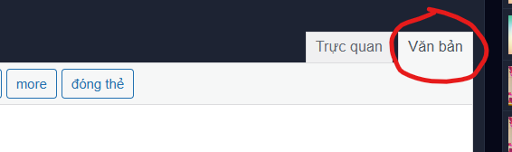

# 0. Spelling

Đầu tiên, dĩ nhiên rồi, hãy chắc chắn bài của bạn không sai chính tả. Khuyến khích dùng :
- [Text Beautify](https://vnkings.com/text-beautify.html) để chỉnh các lỗi dấu câu cơ bản.
- Dùng chức năng kiểm tra chính tả (Cltr+Alt+X) của [Google docs](https://docs.google.com/document/u/0/) để sửa lỗi chính tả.

Sau khi đã chắc chắn rồi, hãy đưa vào [Chức năng Đăng bài](https://vnkings.com/quan-ly-bai-viet/dang-bai.html) để chỉnh sửa lần cuối.

Hãy chắc chắn hoàn tất việc chỉnh sửa vì khi đến bước chính, chúng ta sẽ chỉ dùng tab 'Văn bản'.

