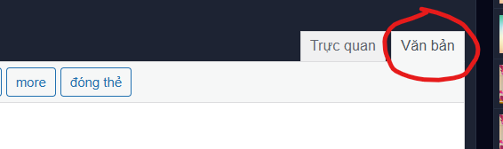
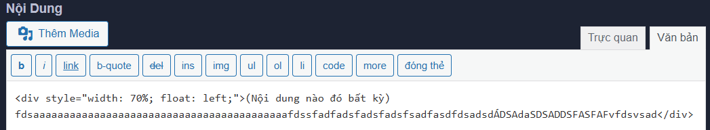
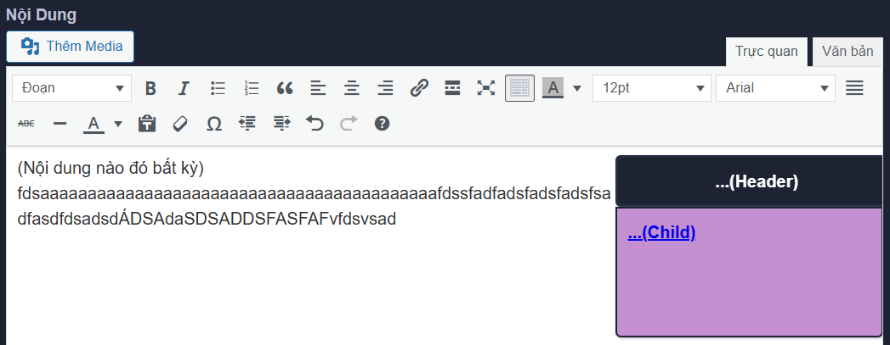

# 1. Timeline

Trước khi bắt đầu, hãy sửa hết chính tả đã. Một số mẹo nằm ở [đây](0.%20Spelling.md).

Được rồi, hãy nhìn lại brief code của chúng ta:

```
<div style="width: 70%;float: left">
...(Nội dung)
<p id='(tên)'>...</p>
</div>
<div style="position: sticky;top: 6%;float: left;width: 30%;color: white;font-family: Arial;font-weight: bold">
<div style="background-color: #1d2333;border: 3px solid #272f41;padding: 10px;text-align: center;border-radius: 5px;width: 100%;box-shadow: 1px 1px 2px #bbbbbb">...(Header)</div>
<div style="margin: auto;width: 95%;background-color: #c490d1;border: 2px solid #1d2333;border-radius: 0px 0px 5px 5px;float: top;padding: 10px;box-shadow: 1px 1px 2px #bbbbbb;height: ...px;overflow: auto"">
<a href="#(tên)">...(Child)</a>
</div>
</div>
```

Đầu tiên, hãy mở [Chức năng Đăng bài](https://vnkings.com/quan-ly-bai-viet/dang-bai.html) và bấm vào phần 'Văn bản'.



Hãy viết dòng đầu tiên là:

```
<div style="width: 70%;float: left">
```

Sau đó 'Dán' `(Ctrl+V)` nội dung văn bản của bạn. 

Cuối cùng đóng lại bằng:

```
</div>
```

Nó sẽ trông thế này:



Vì để dễ dàng cho mục đích 'Dịch chuyển', hãy liệt kê những chỗ bạn muốn di chuyển đến.

Ví dụ:

```
Tôi có một đống văn bản nằm ở đây.
Nhiều hơn.
Và nhiều hơn nữa


Và tôi nhận ra chỗ này cần được dịch chuyển đến.
```

Hãy đặt id cho dòng trên nó (Vì cái heading của web dùng `position: sticky`):

```
Tôi có một đống văn bản nằm ở đây.
Nhiều hơn.
Và nhiều hơn nữa

(Tôi sẽ đặt id chỗ này)
Và tôi nhận ra chỗ này cần được dịch chuyển đến.
```

Dùng `<p id='(tên id muốn đặt)'>...</p>` (Có thể thay đổi ... theo ý muốn). Nó sẽ thành:

```
Tôi có một đống văn bản nằm ở đây.
Nhiều hơn.
Và nhiều hơn nữa

<p id='(tên id muốn đặt)'></p>
Và tôi nhận ra chỗ này cần được dịch chuyển đến.
```

Hãy đặt hết đi, nhớ lưu id vào Notepad. Sau khi đã xong thì đến bước tiếp theo.

Xuống cuối dòng và viết hết đống này vào (Đừng chuyển sang 'Trực quan' vội, hỏng hết đấy):

```
<div style="position: sticky;top: 6%;float: left;width: 30%;color: white;font-family: Arial;font-weight: bold">
<div style="background-color: #1d2333;border: 3px solid #272f41;padding: 10px;text-align: center;border-radius: 5px;width: 100%;box-shadow: 1px 1px 2px #bbbbbb">...(Header)</div>
<div style="margin: auto;width: 95%;background-color: #c490d1;border: 2px solid #1d2333;border-radius: 0px 0px 5px 5px;float: top;padding: 10px;box-shadow: 1px 1px 2px #bbbbbb;height: ...px;overflow: auto"">
<a href="#(tên)">...(Child)</a>
</div>
</div>
```

Đến lúc thành coder thực thụ rồi, Trong này có 3 chỗ cần thay thế:
- `...(Header)` nằm ở `<div>` thứ hai
- `...(Child)` nằm ở `<div>` thứ ba
- `height: ...px` nằm trong phần `<a>`

Để an toàn, hãy chỉnh `height: 100px`.

Giờ thì ổn rồi, bạn có thể chỉnh sang 'Trực quan' thoải mái. Chúng ta thấy cái này.



**Lưu ý:** Hiệu ứng thực sự chỉ có khi bạn đã đăng bài, 'Trực quan' chỉ để nhìn thôi.

Tuyệt, giờ chỉnh qua 'Văn bản' và thấy code bạn chỉnh cho đẹp nãy giờ tan tành hết :D

Không sao, giờ bạn đã hiểu rõ `...(Header)` và `...(Child)` có mục đích gì ở đây rồi.

Hãy chỉnh `...(Header)` theo ý mình muốn. Tôi sẽ đặt là 'Mốc thời gian'.

Còn thằng `...(Child)` thì theo bước bên dưới:
- Bạn tìm thấy `<a href="#(tên)">...(Child)</a>` chứ? Đó là nơi giúp ta dịch chuyển.
- Hãy mở lại Notepad và nhìn những id bạn đã đặt (đứa nào skip thì khóc đi), hãy dán 1 id của bạn vào `(tên)`, rồi đổi `...(Child)` thành tên bạn muốn.
- Nếu muốn thêm, hãy xuống dòng và 'Dán' `<a href="#(tên)">...(Child)</a>` vào. Nhớ xuống dòng, làm ơn.

Được rồi, hãy chắc chắn bạn đã dùng hết số id. Chuyển qua phần 'Trực quan' xem.

### Nói sơ về phương pháp 'Dịch chuyển':

Chúng ta cần 2 phần tử:

- Nơi bấm vào để dịch chuyển đi. `(<a href="#id">Bấm vào đây</a>)`

- Nơi ta được dịch chuyển đến. `(<p id='id'>Được dịch chuyển đến đây</p>)`

Khi ra viết, đầy đủ cả hai:

```
<a href="#id">Bấm vào đây</a>
<p id='id'>Được dịch chuyển đến đây</p>
```

Nếu bấm vào 'Bấm vào đây', bạn sẽ được dịch chuyển đến 'Được dịch chuyển đến đây'.

### Tiếp tục:

Nếu bạn đã đi đến đây thì tốt quá. Hãy đăng bài để chờ được duyệt. Giờ bạn sẽ thấy hiệu ứng 'Sticky' và cả khả năng 'Dịch chuyển'. Nhưng chưa hết đâu, nhớ `height: 100px` chứ? Hãy vào phần 'Sửa bài' và điều chỉnh `px` phù hợp.

**Lưu ý:** Nhớ làm sao cả điện thoại và máy tính đều hiển thị ổn nhé. Hiển thị ở đây là sau khi đã đăng, nằm ở phần chờ duyệt, cái hiện thị trong 'Trực quan' là sai nhé.

Nếu gặp phải vấn đề, hãy báo vào [đây](https://github.com/Linos1391/Vnking_Template/issues).
