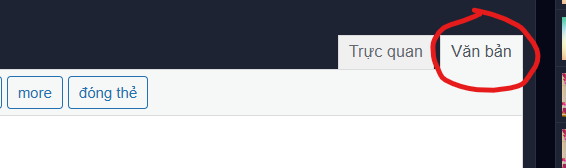

# 2. Timeline

Trước khi bắt đầu, hãy sửa hết chính tả đã. Một số mẹo nằm ở [đây](0.%20Spelling.md).

Được rồi, hãy nhìn lại brief code của chúng ta:

```
<!--Notice: height div = 52.5 * (số lựa chọn - 1) + 47.5-->

<h3>...(Content / Question)</h3>
1. (action 1)

2. (action 2)

<div style="height: 100px;background-color: #1d2333;border: 2 solid #272f41;padding: 5px;border-radius: 5px;box-shadow: 1px 1px 2px #bbbbbb">

<button class="collapsed" style="height: 40px;width: 100%;background-color: #f0ad4e;color: #ffffff;border-color: #eea236;border-radius: 5px;font-size: 20px;" data-toggle="collapse" data-target="#id1" aria-expanded="false">Lựa chọn 1</button>
<button class="collapsed" style="height: 40px;width: 100%;background-color: #f0ad4e;color: #ffffff;border-color: #eea236;border-radius: 5px;font-size: 20px;" data-toggle="collapse" data-target="#id2" aria-expanded="false">Lựa chọn 2</button>

</div>
<div id="id1" class="collapse" style="height: 0px" aria-expanded="false">Ending 1</div>
<div id="id2" class="collapse" style="height: 0px" aria-expanded="false">Ending 2</div>
```

Hãy chắc chắn mình đã chỉnh sửa toàn bộ và lưu hết vào Notepad. Không là sau này khóc đấy.

Đầu tiên, hãy mở [Chức năng Đăng bài](https://vnkings.com/quan-ly-bai-viet/dang-bai.html) và bấm vào phần 'Văn bản'.



Hãy 'Dán' `(Ctrl+V)` vào đó:

```
<h3>...(Content / Question)</h3>
1. (action 1)

2. (action 2)
```

Hãy chỉnh `...(Content / Question)`, `(action 1)`, `(action 2)` theo ý muốn. Đây là bước dễ, lưu ý là có thể thêm lựa chọn nếu muốn.

Bây giờ là phần chính. Hãy viết đống này vào:

```
<div style="height: 100px;background-color: #1d2333;border: 2 solid #272f41;padding: 5px;border-radius: 5px;box-shadow: 1px 1px 2px #bbbbbb">

<button class="collapsed" style="height: 40px;width: 100%;background-color: #f0ad4e;color: #ffffff;border-color: #eea236;border-radius: 5px;font-size: 20px;" data-toggle="collapse" data-target="#id1" aria-expanded="false">Lựa chọn 1</button>
<button class="collapsed" style="height: 40px;width: 100%;background-color: #f0ad4e;color: #ffffff;border-color: #eea236;border-radius: 5px;font-size: 20px;" data-toggle="collapse" data-target="#id2" aria-expanded="false">Lựa chọn 2</button>

</div>
<div id="id1" class="collapse" style="height: 0px" aria-expanded="false">Ending 1</div>
<div id="id2" class="collapse" style="height: 0px" aria-expanded="false">Ending 2</div>
```

Về cơ bản, cái `<div>` đầu tiên là layout cho chỗ lựa chọn. Hai cái `<button>` là hai nút lựa chọn. Hai cái `<div>` cuối là nội dung tương ứng với từng lựa chọn.


Khi đã hiểu về cấu trúc, chúng ta sẽ thay thế id trong `data-target` của từng button.

Ví dụ, cái đầu tiên có `data-target` là id của cái `<div>` gần cuối. Nghĩa là khi bấm nút, nội dung của `<div>` với id tương ứng sẽ xuất hiện. Lưu ý trước id trong `data-target` phải có `#`.

Theo hướng giải quyết này. Ta có thể thêm số lựa chọn đến vô tận, điều tuyệt vời là có thể tạo ra lựa chọn nhỏ hơn trong từng lựa chọn lớn hơn. Nhưng lưu ý độ phức tạp của nó nhé. Độc giả không thích mình thành **nạn nhân** đâu. 

Giờ hãy lấy nội dung đã chỉnh sửa trong Notepad ra. Lưu ý nội dung được chép vào phải ở trong phần 'Văn bản' vì trực quan không có chỉ toàn chữ, không có hiệu ứng hay khoảng cách thụt lùi.

Thay thế nội dung vào `Ending 1` và `Ending 2`. Vậy là xong. Nếu giờ bấm vào 'Trực quan', bạn sẽ thấy đống chữ đang chồng chéo lên nhau.

Đây là trường hợp của tôi với 4 ending:


Đó là lý do ta phải chuẩn bị thật kỹ. Thậm chí một lỗi sai chính tả cũng rất khó sửa. Bây giờ cách duy nhất để dò là kiểm tra trong phần 'Văn bản'.

Chưa hết, đây là phần cuối cùng. Ở trên brief code tôi có ghi chú:

```
<!--Notice: height div = 52.5 * (số lựa chọn - 1) + 47.5-->
```

Ở `<div>` đầu tiên, hãy sửa `height` của nó theo công thực ở trên. Số lựa chọn là số `<button>` trong đó.

**Lưu ý:** Trong truyện ngắn tôi có dùng phương pháp 'Dịch chuyển' đã nói sơ trong những dòng cuối của [1. Timeline.md](1.%20Timeline.md/#nói-sơ-về-phương-pháp-dịch-chuyển). Nếu bạn có nhu cầu thì hãy đọc qua.

Nếu gặp phải vấn đề, hãy báo vào [đây](https://github.com/Linos1391/Vnking_Template/issues).
